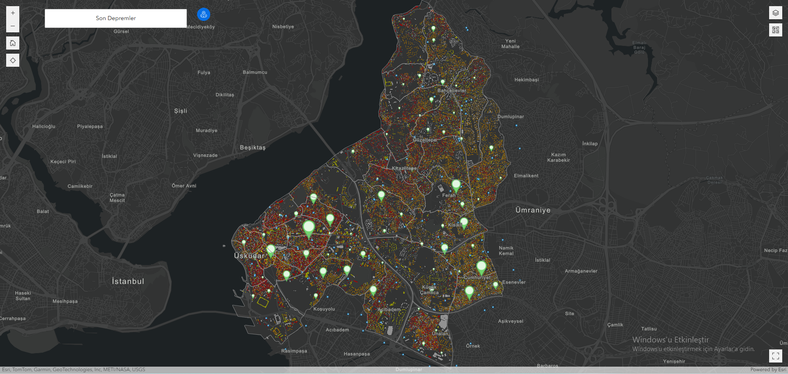
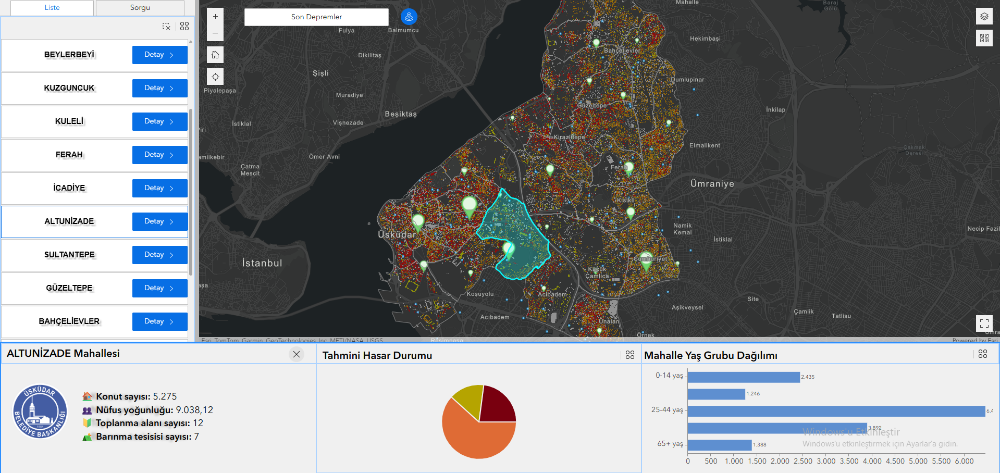
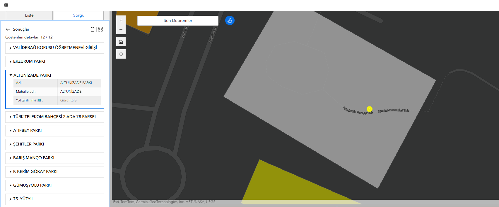
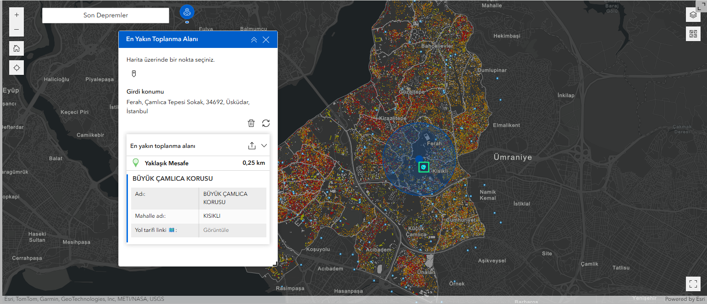
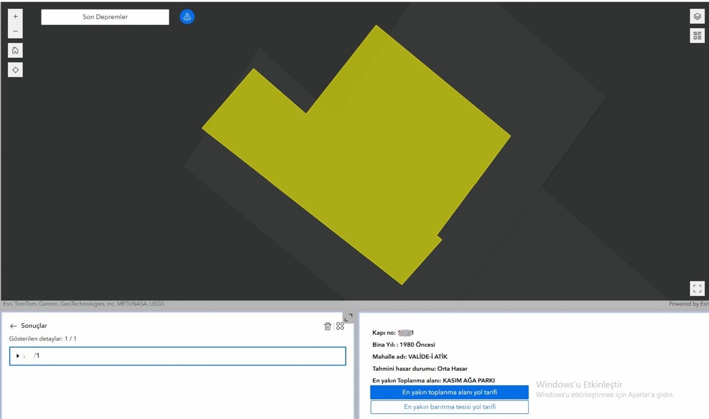

# 🌐 ArcGIS Experience Builder ile Deprem Analiz ve Bilgilendirme Uygulaması

Bu proje, Üsküdar Belediyesi'ndeki stajım kapsamında geliştirilmiş olup, afet hazırlık süreçlerini desteklemek ve kullanıcıların konum bazlı bilgiye hızlı ve etkili şekilde ulaşabilmesini sağlamak amacıyla ArcGIS Web Experience Builder kullanılarak oluşturulmuştur.

## 🧩 Uygulama Özellikleri

### 🔹 Mahalle Listesi Üzerinden Bilgi Erişimi
Kullanıcılar mahalle listesinden bir mahalle seçerek aşağıdaki bilgilere erişebilir:
- Yaş grubu dağılımı (grafik gösterim)
- Tahmini bina hasar durumu (grafik gösterim)
- Toplam konut sayısı
- Nüfus yoğunluğu
- Mahalledeki barınma tesisi ve toplanma alanı sayıları

### 🔍 Mahalle Bazlı Toplanma Alanı Sorgusu
Kullanıcılar seçilen mahalledeki toplanma alanlarının listesini görüntüleyebilir.  
Her alanın detayında, kullanıcıyı Google Maps üzerinde açılacak bir bağlantıyla navigasyona yönlendiren yol tarifi linki yer alıyor.

### 📍 En Yakın Toplanma Alanı Aracı
Haritada herhangi bir noktaya tıklanarak o konuma en yakın toplanma alanı ve yaklaşık mesafesi görüntülenebilir.  
Detay kısmından **Google Maps bağlantısı** ile dış yönlendirme sağlanır.

### 🏚️ Mahalle ve Kapı No Bazlı Sorgulama
Kullanıcılar mahalle ve kapı numarasını girerek:
- Binanın tahmini hasar durumu
- En yakın toplanma alanı ve barınma tesisi
- İlgili noktalar için **Google Maps bağlantı** butonları sunuluyor.

### 📡 Son Depremler Butonu
AFAD'ın son depremler sayfasına yönlendiren bir bağlantı ile kullanıcılar güncel depremleri harici olarak görüntüleyebilir.

---

## 🛠️ Kullanılan Teknolojiler

- **ArcGIS Experience Builder**
- **PostgreSQL + PostGIS**
- **ArcGIS Enterprise**
- **Arcade Expressions**

---
## 📦 Veri
Bu uygulamada kullanılan veriler, Üsküdar Belediyesi tarafından sağlanan veya kurumsal izinle elde edilen mekânsal veri setlerine dayanmaktadır.
### 🔹 Kullanılan Katmanlar
🏠 Bina Verisi: Binanın yapım yılı, mahalle adı, tahmini hasar durumu gibi verileri içerir
🧭 Toplanma Alanları: Noktasal geometriye sahip toplanma alanları katmanı, her bir alanın adı, mahalle bilgisi içerir.
🛌 Barınma Tesisleri: Üsküdar ilçesinde afet anında barınma amacıyla kullanılabilecek tesislerin konum bilgileri.
🧑‍🤝‍🧑 Mahalle Demografik Verisi: Mahalle bazında nüfus, yaş grubu dağılımı, konut sayısı ve nüfus yoğunluğu bilgileri içerir.
📍 Numarataj Verisi: Mahalle bilgisi ve kapı numarası gibi bilgiler içerir.

## Veri hazırlık
- [`veri_hazirlik_1.sql`](sql_veri_hazirlik/veri_hazirlik_1.sql)
- [`veri_hazirlik_2.sql`](sql_veri_hazirlik/veri_hazirlik_2.sql)
- [`veri_hazirlik_3.sql`](sql_veri_hazirlik/veri_hazirlik_3.sql)

Verilerin tümü PostgreSQL/PostGIS ve ArcGIS Pro aracılığıyla düzenlenmiş ve ArcGIS Enterprise ortamında yayınlanarak Web Experience Builder uygulamasına entegre edilmiştir.
---

## 📷 Uygulama Görselleri

> Ana ekran – Mahalle seçimi ve detay bilgileri  
> 

> Ana ekran – Mahalle seçimi ve detay bilgileri  
> 

> Toplanma alanı listesi
> 

> Tıklanılan noktaya en yakın toplanma alanı 
> 

> Kapı no bazlı bina risk durumu ve en yakın toplanma alanı sorgusu
> 
---
